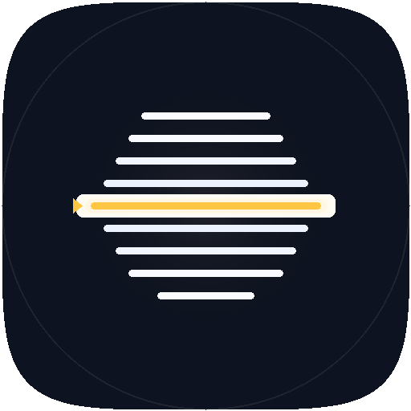

# presently.

A modern, high-performance teleprompter and video recording application.



## 🚀 Beta Release

**Current Version:** `0.1.0`

`presently.` is currently in its beta phase. We are actively refining the core experience and adding features to make it the best tool for public speakers, YouTubers, and educators.

## 📥 Download

Head to the [**Releases page**](https://github.com/carlmitzchel/present.ly/releases) to download the latest version for your platform.

| Platform | Status | File |
|---|---|---|
| Windows | ✅ Fully supported | `.exe` installer |
| macOS | ⚠️ Unofficial | `.dmg` |
| Linux | ⚠️ Unofficial | `.AppImage` or `.deb` |

> macOS and Linux builds are available but not officially supported yet. Full support is coming once budget permits.

---

## 🛠 Tech Stack

### Frontend

- **React 19** & **TypeScript**
- **Vite** (Build tool)
- **Tailwind CSS 4** (Styling)
- **Zustand** (State management)
- **Shadcn UI** (Components)
- **Lucide React** (Iconography)

### Desktop & Backend

- **Tauri v2** (Rust-based desktop framework)
- **SQLite** (Local database for settings and history)
- **Axum** & **Tokio** (Local server for mobile remote control)
- **FFmpeg** (Sidecar integration for video processing)

---

## ✨ Current Functionalities

- **Smart Teleprompter**
  - Smooth, high-performance text scrolling.
  - Adjustable scroll speed and font size in real-time.
  - **Focus Mode**: Fades surrounding lines to help you keep track of your active spot.
  - Text alignment options (Left, Center, Right).

- **Video Recording**
  - Integrated camera view while reading.
  - **FFmpeg Remuxing**: Records in WebM for stability and automatically converts to MP4 (lossless) for maximum compatibility.
  - Support for high-resolution capture (up to 4K where available).
  - Audio level visualization.

- **Mobile Remote Control**
  - Control your teleprompter from your smartphone.
  - Instant pairing via **QR Code**.
  - Operates over your local Wi-Fi network—no cloud account required.

- **Hardware Compatibility**
  - **Mirror Mode**: Horizontal and Vertical flipping to support physical beam-splitter teleprompter glass.
- **Script Management**
  - Load and save `.txt` or `.md` files.
  - Persistent "Recent Files" history.
  - Custom recording save paths.

---

## 🔮 Future Functionalities

- [ ] **Advanced Video Overlays**: Add lower thirds, logos, or backgrounds directly to your recording.
- [ ] **Multi-Camera Toggle**: Switch between different camera angles during a session.
- [ ] **Script Editor**: Rich text editing with highlight colors and emphasis tags.
- [ ] **Cloud Sync**: Optional synchronization to keep your scripts across multiple devices.
- [ ] **Meeting Integration**: Virtual camera output for Zoom, Teams, and OBS.
- [ ] **Smart Analyze**: Analyze your script and provide insights on how to improve your presentation.
- [ ] **Magic!**: Automatically parse your script for better teleprompting experience.

---

## 📦 Installation & Development

### Prerequisites

- [Rust](https://www.rust-lang.org/tools/install)
- [Node.js](https://nodejs.org/) (v20+)

### Setup

1. Clone the repository.
2. Install dependencies:
   ```bash
   npm install
   ```
3. Setup the FFmpeg sidecar (downloads the correct binary for your OS):
   ```bash
   npm run setup:ffmpeg
   ```
4. Run in development mode:
   ```bash
   npm run tauri dev
   ```

---

## ⚠️ Installation Notes

**Windows**: SmartScreen may warn about an unknown publisher. Click **"More info"** then **"Run anyway"**. This is normal for unsigned open source apps.

**macOS**: If you see a "damaged and can't be opened" error, open Terminal and run:
xattr -d com.apple.quarantine /Applications/presently.app
Or go to **System Settings → Privacy & Security** and click **"Open Anyway"**.

Full code signing and notarization for all platforms is coming once budget permits.

## 📄 License

MIT — see [LICENSE](LICENSE) for details.
